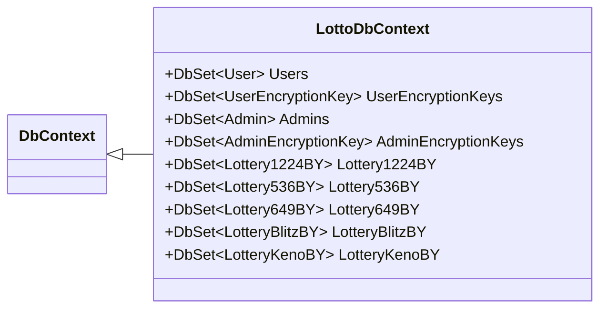

# Class Diagram: Data

```mermaid
classDiagram
    direction LR
    classDef external fill:#f9f9f9,stroke:#333,stroke-dasharray: 5 5
    class LottoDbContext {
        +DbSet~User~ Users
        +DbSet~UserEncryptionKey~ UserEncryptionKeys
        +DbSet~Admin~ Admins
        +DbSet~AdminEncryptionKey~ AdminEncryptionKeys
        +DbSet~Lottery1224BY~ Lottery1224BY
        +DbSet~Lottery536BY~ Lottery536BY
        +DbSet~Lottery649BY~ Lottery649BY
        +DbSet~LotteryBlitzBY~ LotteryBlitzBY
        +DbSet~LotteryKenoBY~ LotteryKenoBY
    }
    class DbContext:::external
    DbContext <|-- LottoDbContext

```