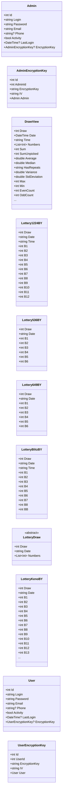

# Class Diagram: Models

```mermaid
classDiagram
    direction LR
    classDef external fill:#f9f9f9,stroke:#333,stroke-dasharray: 5 5
    class Admin {
        +int Id
        +string Login
        +string Password
        +string Email
        +string? Phone
        +bool Activity
        +DateTime? LastLogin
        +AdminEncryptionKey? EncryptionKey
    }
    class AdminEncryptionKey {
        +int Id
        +int AdminId
        +string EncryptionKey
        +string IV
        +Admin Admin
    }
    class DrawView {
        +int Draw
        +DateTime Date
        +string Time
        +List~int~ Numbers
        +int Sum
        +int SumUnpicked
        +double Average
        +double Median
        +string HasRepeats
        +double Variance
        +double StdDeviation
        +int Max
        +int Min
        +int EvenCount
        +int OddCount
        ...
    }
    class Lottery1224BY {
        +int Draw
        +string Date
        +string Time
        +int B1
        +int B2
        +int B3
        +int B4
        +int B5
        +int B6
        +int B7
        +int B8
        +int B9
        +int B10
        +int B11
        +int B12
    }
    class Lottery536BY {
        +int Draw
        +string Date
        +int B1
        +int B2
        +int B3
        +int B4
        +int B5
        +int B6
    }
    class Lottery649BY {
        +int Draw
        +string Date
        +int B1
        +int B2
        +int B3
        +int B4
        +int B5
        +int B6
    }
    class LotteryBlitzBY {
        +int Draw
        +string Date
        +string Time
        +int B1
        +int B2
        +int B3
        +int B4
        +int B5
        +int B6
        +int B7
        +int B8
        +int BB
    }
    class LotteryDraw {
        <<abstract>>
        +int Draw
        +string Date
        +List~int~ Numbers
    }
    class LotteryKenoBY {
        +int Draw
        +string Date
        +int B1
        +int B2
        +int B3
        +int B4
        +int B5
        +int B6
        +int B7
        +int B8
        +int B9
        +int B10
        +int B11
        +int B12
        +int B13
        ...
    }
    class User {
        +int Id
        +string Login
        +string Password
        +string Email
        +string? Phone
        +bool Activity
        +DateTime? LastLogin
        +UserEncryptionKey? EncryptionKey
    }
    class UserEncryptionKey {
        +int Id
        +int UserId
        +string EncryptionKey
        +string IV
        +User User
    }

```