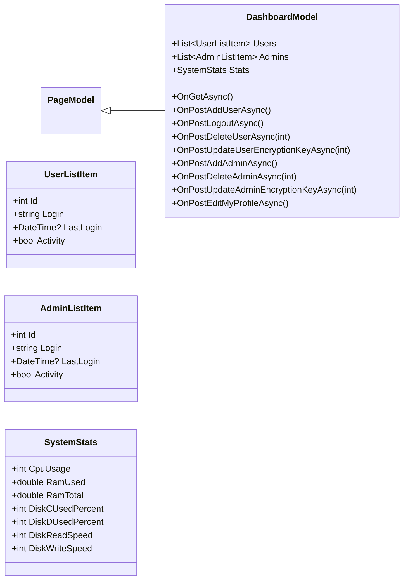

# Class Diagram: Admin

```mermaid
classDiagram
    direction LR
    classDef external fill:#f9f9f9,stroke:#333,stroke-dasharray: 5 5
    class DashboardModel {
        +List~UserListItem~ Users
        +List~AdminListItem~ Admins
        +SystemStats Stats
        +OnGetAsync()
        +OnPostAddUserAsync()
        +OnPostLogoutAsync()
        +OnPostDeleteUserAsync(int)
        +OnPostUpdateUserEncryptionKeyAsync(int)
        +OnPostAddAdminAsync()
        +OnPostDeleteAdminAsync(int)
        +OnPostUpdateAdminEncryptionKeyAsync(int)
        +OnPostEditMyProfileAsync()
    }
    class PageModel:::external
    PageModel <|-- DashboardModel
    class UserListItem {
        +int Id
        +string Login
        +DateTime? LastLogin
        +bool Activity
    }
    class AdminListItem {
        +int Id
        +string Login
        +DateTime? LastLogin
        +bool Activity
    }
    class SystemStats {
        +int CpuUsage
        +double RamUsed
        +double RamTotal
        +int DiskCUsedPercent
        +int DiskDUsedPercent
        +int DiskReadSpeed
        +int DiskWriteSpeed
    }

```