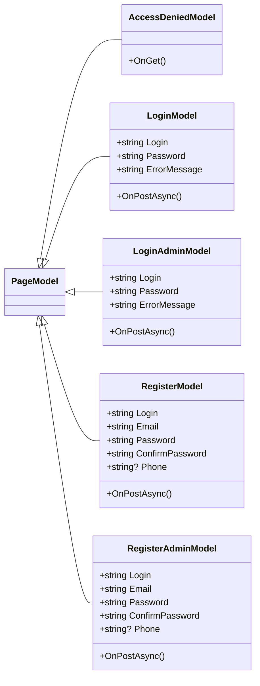

# Class Diagram: Auth

```mermaid
classDiagram
    direction LR
    classDef external fill:#f9f9f9,stroke:#333,stroke-dasharray: 5 5
    class AccessDeniedModel {
        +OnGet()
    }
    class PageModel:::external
    PageModel <|-- AccessDeniedModel
    class LoginModel {
        +string Login
        +string Password
        +string ErrorMessage
        +OnPostAsync()
    }
    class PageModel:::external
    PageModel <|-- LoginModel
    class LoginAdminModel {
        +string Login
        +string Password
        +string ErrorMessage
        +OnPostAsync()
    }
    class PageModel:::external
    PageModel <|-- LoginAdminModel
    class RegisterModel {
        +string Login
        +string Email
        +string Password
        +string ConfirmPassword
        +string? Phone
        +OnPostAsync()
    }
    class PageModel:::external
    PageModel <|-- RegisterModel
    class RegisterAdminModel {
        +string Login
        +string Email
        +string Password
        +string ConfirmPassword
        +string? Phone
        +OnPostAsync()
    }
    class PageModel:::external
    PageModel <|-- RegisterAdminModel

```