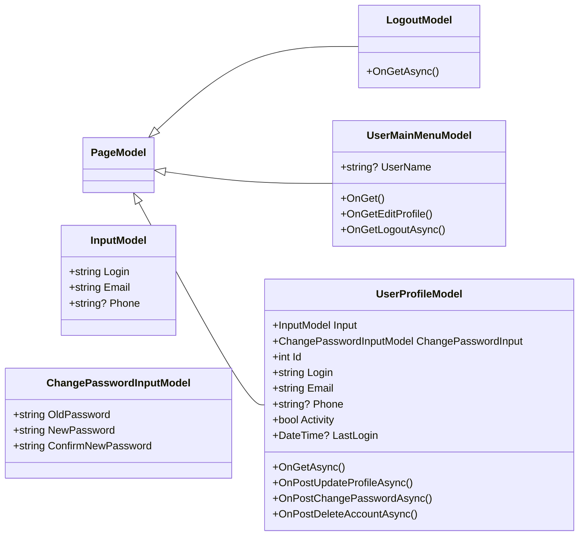

# Class Diagram: User

```mermaid
classDiagram
    direction LR
    classDef external fill:#f9f9f9,stroke:#333,stroke-dasharray: 5 5
    class LogoutModel {
        +OnGetAsync()
    }
    class PageModel:::external
    PageModel <|-- LogoutModel
    class UserMainMenuModel {
        +string? UserName
        +OnGet()
        +OnGetEditProfile()
        +OnGetLogoutAsync()
    }
    class PageModel:::external
    PageModel <|-- UserMainMenuModel
    class UserProfileModel {
        +InputModel Input
        +ChangePasswordInputModel ChangePasswordInput
        +int Id
        +string Login
        +string Email
        +string? Phone
        +bool Activity
        +DateTime? LastLogin
        +OnGetAsync()
        +OnPostUpdateProfileAsync()
        +OnPostChangePasswordAsync()
        +OnPostDeleteAccountAsync()
    }
    class PageModel:::external
    PageModel <|-- UserProfileModel
    class InputModel {
        +string Login
        +string Email
        +string? Phone
    }
    class ChangePasswordInputModel {
        +string OldPassword
        +string NewPassword
        +string ConfirmNewPassword
    }

```