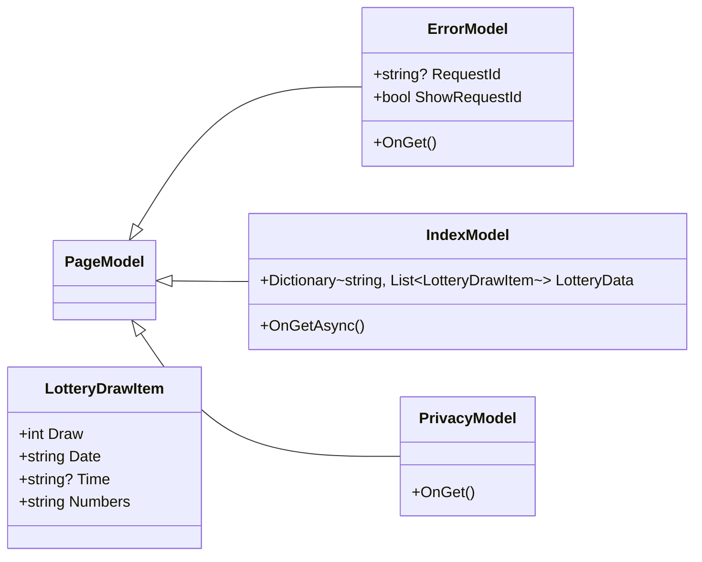

# Class Diagram: Pages

```mermaid
classDiagram
    direction LR
    classDef external fill:#f9f9f9,stroke:#333,stroke-dasharray: 5 5
    class ErrorModel {
        +string? RequestId
        +bool ShowRequestId
        +OnGet()
    }
    class PageModel:::external
    PageModel <|-- ErrorModel
    class IndexModel {
        +Dictionary~string, List~LotteryDrawItem~~ LotteryData
        +OnGetAsync()
    }
    class PageModel:::external
    PageModel <|-- IndexModel
    class LotteryDrawItem {
        +int Draw
        +string Date
        +string? Time
        +string Numbers
    }
    class PrivacyModel {
        +OnGet()
    }
    class PageModel:::external
    PageModel <|-- PrivacyModel

```